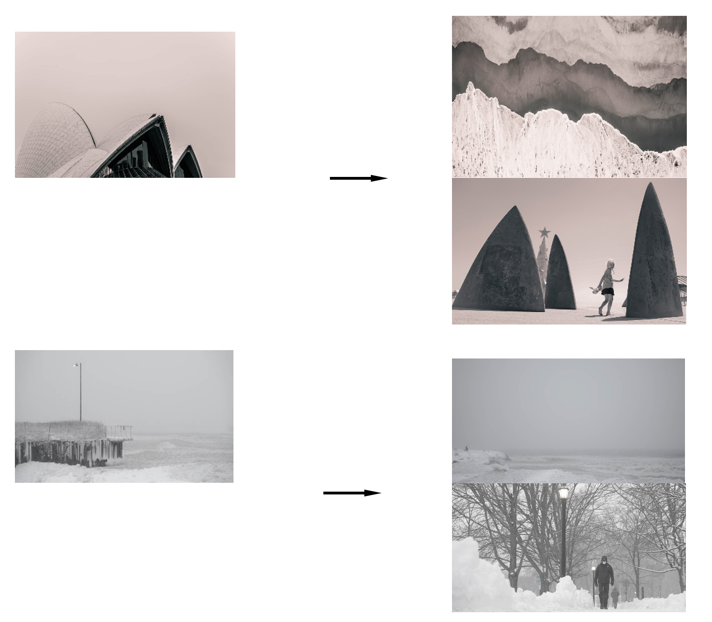

# Find Photos with Similar Style: A MLT Recommendation System Augmenting Photographers' Websites

**Author:** Hao Xu

**QA:** Junpeng (Marshall) Jiang


<!-- toc -->
- [Project Charter](#project_charter)
- [Directory structure](#directory-structure)
- [Running the app](#running-the-app)
  * [1. Initialize the database](#1-initialize-the-database)
    + [Create the database with a single song](#create-the-database-with-a-single-song)
    + [Adding additional songs](#adding-additional-songs)
    + [Defining your engine string](#defining-your-engine-string)
      - [Local SQLite database](#local-sqlite-database)
  * [2. Configure Flask app](#2-configure-flask-app)
  * [3. Run the Flask app](#3-run-the-flask-app)
- [Running the app in Docker](#running-the-app-in-docker)
  * [1. Build the image](#1-build-the-image)
  * [2. Run the container](#2-run-the-container)
  * [3. Kill the container](#3-kill-the-container)
  * [Workaround for potential Docker problem for Windows.](#workaround-for-potential-docker-problem-for-windows)

<!-- tocstop -->

## Project Charter

#### Background 
It's always a good practice in the photography community to frequently browse others' works to get inspiration and new ideas. Some common destinations for photo galleries include [Adobe Stock](https://stock.adobe.com/), [500px.com](https://500px.com/), [Pinterest](https://www.pinterest.com/) etc. Besides, for customization, most professional photographers also build their personal websites to showcase their works and share ideas. However, without proper labeling, photographers sometimes find it harder to quickly find photos in a certain style from such a huge volume of available sources.

#### Vision
To make the photos better organized and easier to find, big platforms like 500px.com always enable users to tag their pictures with meaningful labels so they can make recommendations based on similarities. However, users aren't obligated to tag their uploads properly, and the labels are not always accurate. On top of that, it's is even harder for photographers who build their own websites to create and deploy recommendation systems to engage their visitors. 

This app is designed to solve the problem by building unsupervised learning models to automatically process all the photos and cluster them into meaningful groups. By doing this, photo gallery websites become capable of finding photos in similar styles without manually labeling them. 

#### Mission
The user will upload a photo (or select an existing photo), and the recommender will output a list of the most similar photos available on the website database leveraging clustering algorithms. The photos that will be used for this project are from my own website: https://elementarydeduction.com/ (Features representing the style of the photos will be generated using RGB meta data, potentially leveraging rule based feature generator and DL transfer learning.)

Example: 
If a user pick the picture on the left, the system should be able to recommend similar other pictures on the right.



#### Success Criteria

##### Machine Learning Metrics

The app will be using unsupervised learning algorithms. As a result, the metrics will be relatively subjective. We will be using clustering evaluation metrics to determine optimal cluster numbers and test the stability of the clustering results. 

Metrics:
- Silhouette score
- Within-cluster sum of square 

After the app goes live, we will be using AB tests to measure the effectiveness of the recommendations. Also, with user clicks recorded, we can then calculate recommender evaluation metrics

AB testing metrics:
- Click-through rate
- Click through possibility

Recommendation evaluation metircs:
- MAE / RMSE
- Precision / Recall / ROC
- mRR 
- nDCG

##### Business Metrics
To measure the business impact, we can perform AB testing on two versions of the websites, one with the recommender deployed and one without. We can then compare the user engagement level, which can be measured by average time spent, number of pictures clicked etc. 


## Directory structure 

```
├── README.md                         <- You are here
├── api
│   ├── static/                       <- CSS, JS files that remain static
│   ├── templates/                    <- HTML (or other code) that is templated and changes based on a set of inputs
│   ├── boot.sh                       <- Start up script for launching app in Docker container.
│   ├── Dockerfile                    <- Dockerfile for building image to run app  
│
├── config                            <- Directory for configuration files 
│   ├── local/                        <- Directory for keeping environment variables and other local configurations that *do not sync** to Github 
│   ├── logging/                      <- Configuration of python loggers
│   ├── flaskconfig.py                <- Configurations for Flask API 
│
├── data                              <- Folder that contains data used or generated. Only the external/ and sample/ subdirectories are tracked by git. 
│   ├── external/                     <- External data sources, usually reference data,  will be synced with git
│   ├── sample/                       <- Sample data used for code development and testing, will be synced with git
│
├── deliverables/                     <- Any white papers, presentations, final work products that are presented or delivered to a stakeholder 
│
├── docs/                             <- Sphinx documentation based on Python docstrings. Optional for this project. 
│
├── figures/                          <- Generated graphics and figures to be used in reporting, documentation, etc
│
├── models/                           <- Trained model objects (TMOs), model predictions, and/or model summaries
│
├── notebooks/
│   ├── archive/                      <- Develop notebooks no longer being used.
│   ├── deliver/                      <- Notebooks shared with others / in final state
│   ├── develop/                      <- Current notebooks being used in development.
│   ├── template.ipynb                <- Template notebook for analysis with useful imports, helper functions, and SQLAlchemy setup. 
│
├── reference/                        <- Any reference material relevant to the project
│
├── src/                              <- Source data for the project 
│
├── test/                             <- Files necessary for running model tests (see documentation below) 
│
├── app.py                            <- Flask wrapper for running the model 
├── run.py                            <- Simplifies the execution of one or more of the src scripts  
├── requirements.txt                  <- Python package dependencies 
```

## Running Model Pipeline
### 1. Build docker image
```
docker build -t image_app .
```

### 2. Upload raw dataset to S3 bucket

#### 1.1 Add Configuration for AWS S3 bucket

Configure environment variable to store your AWS access_key_id and secret_access_key:

```
export AWS_ACCESS_KEY_ID=<Your Access Key ID>

export AWS_SECRET_ACCESS_KEY=<Your Secret Key ID>
```

#### 1.2 Upload Raw Data to S3

```
docker run -e AWS_ACCESS_KEY_ID -e AWS_SECRET_ACCESS_KEY image_app run.py upload --s3_path=<s3 directory path> --local_path=<local directory with all raw images>
```
example:
```
docker run -e AWS_ACCESS_KEY_ID -e AWS_SECRET_ACCESS_KEY image_app run.py upload --s3_path='s3://2021-msia423-xu-hao/test' --local_path='./data/raw_images'
```

## Running Application

### 1. Store model serving data to RDS


### 2. Build docker image